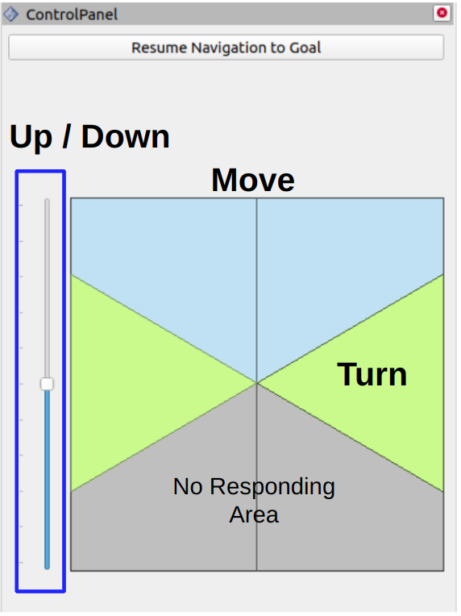

FAR Planner uses a dynamically updated visibility graph for fast replanning. The planner models the environment with polygons and builds a global visibility graph along with the navigation. The planner is capable of handling both known and unknown environments. In a known environment, paths are planned based on a prior map. In an unknown environment, multiple paths are attempted to guide the vehicle to goal based on the environment observed during the navigation. When dynamic obstacles are present, FAR Planner disconnects visibility edges blocked by the dynamic obstacles and reconnects them after regaining visibility. The software implementation uses two CPU threads - one for dynamically updating the visibility graph using ~20% of the thread and the other for path search that can find a path within 3ms, as evaluated on an i7 computer.

<p align="center">
  
</p>

## Usage

The repository has been tested in Ubuntu 20.04 with ROS Noetic. Follow instructions in [Autonomous Exploration Development Environment](https://www.far-planner.com/) to setup the development environment. Make sure to checkout the branch that matches the computer setup, compile, and download the simulation environments.

To setup FAR Planner, clone the repository.
```
git clone https://github.com/Bottle101/Air-FAR.git
```
In a terminal, go to the folder, checkout the 'noetic' branch, and compile.
```
catkin_make
```
To run the code, go to the development environment folder in a terminal, source the ROS workspace, and launch.
```
source devel/setup.sh
roslaunch vehicle_simulator system_unity.launch
```
In another terminal, go to the FAR Planner folder, source the ROS workspace, and launch.
```
source devel/setup.sh
roslaunch airfar_planner airfar.launch
```
Now, users can send a waypoint by 3 step: 1. click the 'Goalpoint3D' button in RVIZ; 2. click a point in the map, hold the left mouse button and scroll the mouse wheel to adjust the altitude;  3. release the mouse. The vehicle will navigate to the goal and build a visibility graph (in cyan) along the way. Areas covered by the visibility graph become free space. When navigating in free space, the planner uses the built visibility graph, and when navigating in unknown space, the planner attempts to discover a way to the goal. By pressing the 'Reset Visibility Graph' button, the planner will reinitialize the visibility graph. 

<p align="center">
  
</p>

Anytime during the navigation, users can use the control panel to navigate the vehicle by clicking the in the black box. The system will switch to *smart joystick* mode - the vehicle tries to follow the virtual joystick command and avoid collisions at the same time. To resume FAR Planner navigation, press the 'Resume Navigation to Goal' button or use the 'Goalpoint3D' button to set a new goal. Note that users can also use a PS3/4 or Xbox controller to repleace the virtual joystick.

<p align="center">
  
  &nbsp;&nbsp;&nbsp;
  
</p>

To launch with a different environment, use the command lines below and replace '\<environment\>' with one of the environment names in the development environment, i.e. 'campus', 'indoor', 'garage', 'tunnel', and 'forest'. Note that when running in campus environment, set *checkTerrainConn* to true in system_campus.launch in the 'src/vehicle_simulator/launch' folder of the development environment.

## Configuration

FAR Planner settings are kept in default.yaml in the 'src/far_planner/config' folder. For Matterport3D environments, the settings are in matterport.yaml in the same folder.
- *is_static_env* (default: true) - set to false if the environment contains dynamic obstacles.
- *is_attempt_autoswitch* (default: true) - set to false to turn off auto switch from non-attemptable navigation (for known environment) to attemptable navigation (for unknown environment).
- *is_viewpoint_extend* (default: true) - set to false to stop extending visibility graph vertices away from objects to gain better viewpoints.
- *is_pub_boundary* (default: false) - set to true to send custom navigation boundaries to the local planner in the development environment.

## Reference

- F. Yang, C. Cao, H. Zhu, J. Oh, and J. Zhang. FAR Planner: Fast, Attemptable Route Planner using Dynamic Visibility Update. IEEE/RSJ Intl. Conf. on Intelligent Robots and Systems (IROS). Kyoto, Japan, Oct. 2022. **Best Student Paper Award.**

## Author

[Botao He](https://github.com/Bottle101) (hebotao101@gmail.com)
